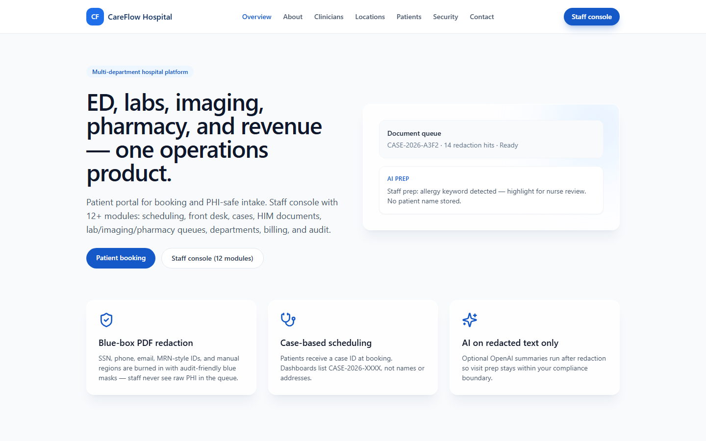
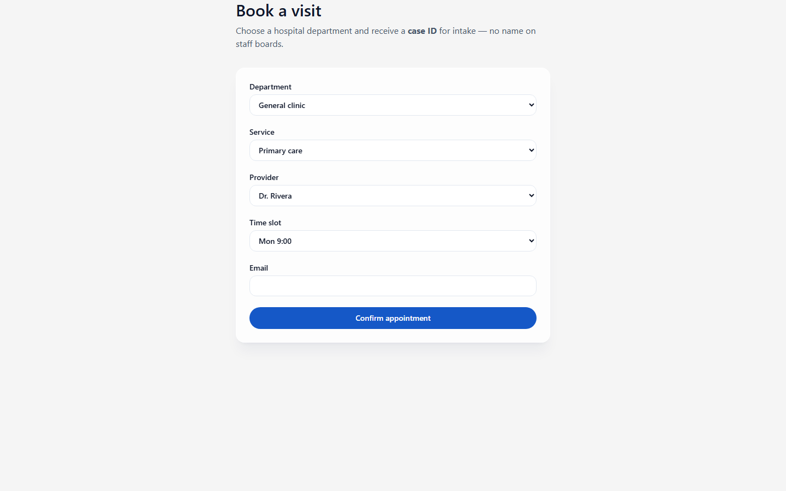
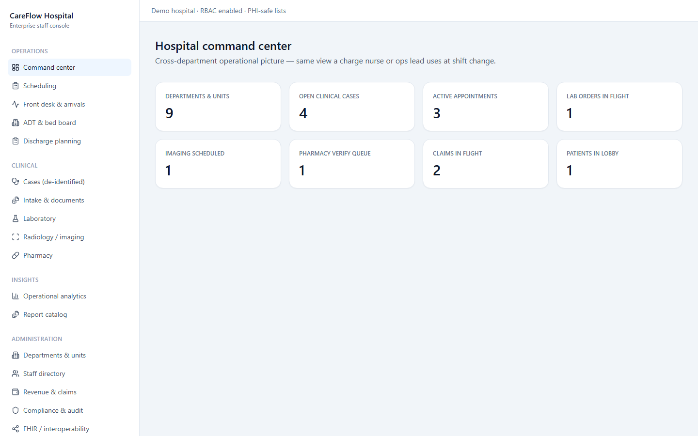
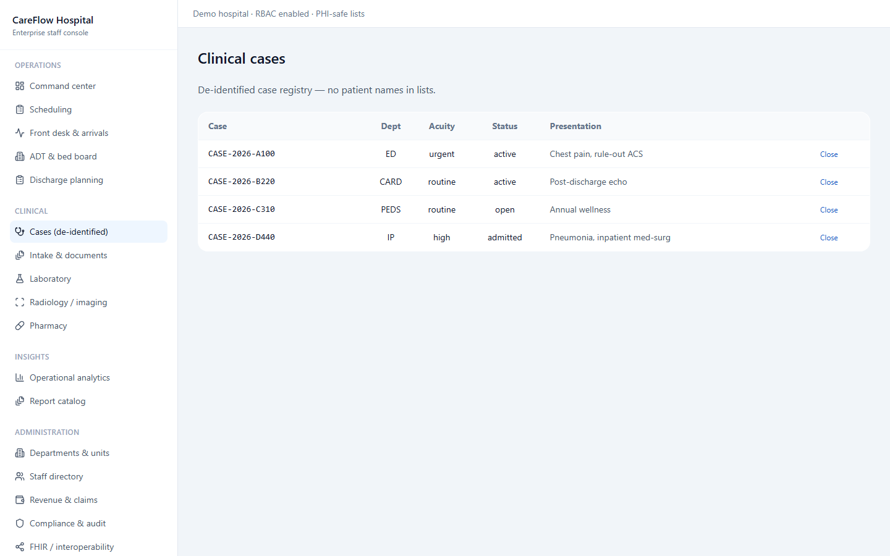
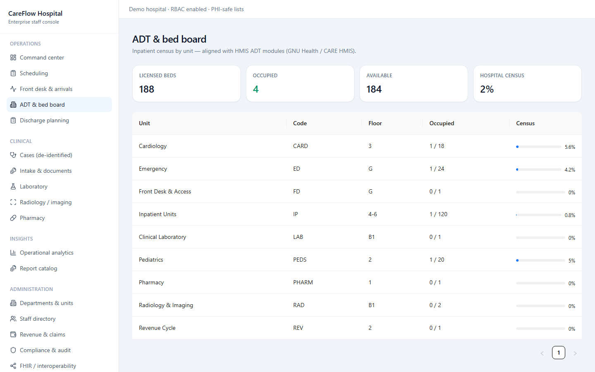

# CareFlow — hospital & clinic operations platform







Hospital and clinic operations platform by **Alexsandro Sunaga** — multi-department hospitals: not a single admin table, but a **staff console** with clinical, diagnostic, and administrative modules plus a **patient portal**.

## Patient portal (public)

| Route | Purpose |
|-------|---------|
| `/portal/book` | Multi-department appointment booking (issues de-identified case ID) |
| `/portal/intake` | PDF upload, automatic + manual PHI redaction |

## Staff console (JWT)

Sign in: **http://127.0.0.1:3011/login** (staff console: `/console` after login)  
`admin@careflow.demo` / `CareflowDemo2026!` (also `clinician@careflow.demo`)

| Module | Route |
|--------|--------|
| Command center | `/console` |
| Scheduling | `/console/scheduling` |
| Front desk & arrivals | `/console/front-desk` |
| Clinical cases | `/console/cases` |
| Intake & HIM documents | `/console/intake` |
| Laboratory | `/console/labs` |
| Radiology / imaging | `/console/imaging` |
| Pharmacy | `/console/pharmacy` |
| Departments & units | `/console/departments` |
| Staff directory | `/console/staff` |
| Revenue & claims | `/console/billing` |
| Compliance & audit | `/console/compliance` |
| Bed board | `/console/beds` |
| Analytics | `/console/analytics` |
| Reports | `/console/reports` |
| FHIR | `/console/fhir` |
| Discharge | `/console/discharge` |

Seeded departments include **ED, Cardiology, Pediatrics, Radiology, Lab, Pharmacy, Inpatient, Front Desk, Revenue Cycle** with staff, rooms, service lines, orders, and claims.

## Stack

FastAPI · SQLAlchemy · PyMuPDF redaction · Vite + React (`web/`) · JWT staff auth

## Run

Setup (once):

```powershell
cd backend
python -m venv .venv
.\.venv\Scripts\pip install -r requirements.txt
.\.venv\Scripts\pip install bcrypt==4.2.1
copy .env.example .env
cd ..\web
copy .env.example .env
npm install
```

Start API (http://127.0.0.1:8011) and web (http://127.0.0.1:3011):

```powershell
.\run.ps1
```

**Reset demo DB** after schema changes: delete `backend\data\careflow.db` and restart the API.

`docker-compose.yaml` starts Postgres and the backend (API on port 8011); it expects a `.env` file at the repo root.

## Tests

```powershell
cd backend
.\.venv\Scripts\pip install -r requirements-dev.txt
.\.venv\Scripts\python -m pytest
```

Uses FastAPI `TestClient` against an isolated temp SQLite database (seeded demo data): health, login (success/401), `/auth/me`, departments and command overview.

## Author

**Alexsandro Sunaga**

## License

MIT License — see [LICENSE](LICENSE).
